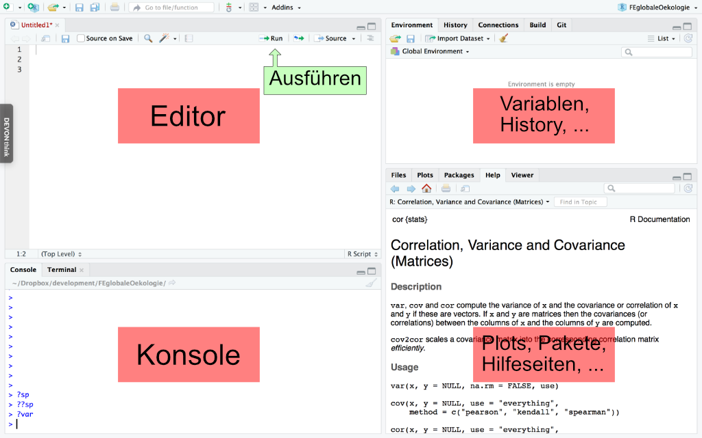

R
=====================
## Kurzbeschreibung
R ist eine Programmiersprache und Programmierumgebung zur statistischen Auswertung und graphischen Darstellung von Daten.
R ist eine open source software, was bedeutet dass die Nutzung kostenfrei und auch der source code öffentlich ist.
Unter www.r-project.org finden sich umfassende Information zu R.

Die Standarddistribution kann durch zahlreiche Pakete erweitert werden, die dann speziellere Methoden beinhalten. Diese Pakete sind online verfügbar z.B. auf dem Internetportal cran.org.


## RStudio
Der Aufruf des Programms R startet eine Konsole in der Befehle ausgeführt werden können. Zur Dokumentation einer Datenanalyse oder zur Entwicklung von Methoden ist es jedoch hilfreich weitere Tools zur Verfügung zu haben, diese werden in Entwicklungsumgebungen zusammengefasst.

[RStudio](https://www.rstudio.com/) ist eine solche Entwicklungsumgebung für [R](https://cran.r-project.org/). Hier können Programme in einem Texteditor geschrieben und getestet werden. Die wichtigsten Teile in RStudio sind der Editor und die Konsole (Figure 1). Im Editor werden Programme geschrieben und als Textdateien gespeichert. In der Konsole werden die Programme oder einzelne Befehle ausgeführt und die Rückmeldung der einzelnen Befehle erfolgt hier. Ausserdem gibt es noch eine Übersicht über bereits benutzte Befehle (History), bestehende Variablen, Dateien, Hilfe, Abbildungen, Übersicht über installierte Pakete und anderes.

```{r echo=FALSE, out.width="100%", fig.align="center", fig.cap="Benutzeroberfläche der RStudio Entwicklungsumgebung."}

```


Hilfe in R
=====================
Aufruf aus der R Konsole
---------------------
* ?\<Befehl\> oder help(\<Befehl\>) zeigt Hilfe für ein bekanntes Kommando an, z.B. ?var zeigt die Hilfe für die Funktion zur Varianzberechnung an
* ??\<Schlagwort\> oder help.search() zeigt Befehle und Bibliotheken an, in deren Hilfeseite das Schlagwort vorkommt.
* Beispiele für eine bestimmte Funktion können mit example("Funktion") aufgerufen werden

Internet Suchmaschine
---------------------
[R] was-ich-wissen-will

-------------------------------------
**Aufgabe**

Welche Optionen gibt es für den Aufruf der Funktion var?
-------------------------------------


R als Taschenrechner
=====================

```{r}
1 + 1
73579 * 34684434
sin(pi / 4)
1 / sqrt(2)
```
**In R, wie in allen Programmiersprachen wird der Punkt als Dezimaltrennzeichen benutzt.**

-------------------------------------
**Aufgabe**

Wofür steht "e+12" hinter einer Zahl?
-------------------------------------

Was sind Variablen?
====================

Variablen speichern Werte, die wir ihnen zuweisen. In R funktioniert das
durch die Zeichen "=" und "<-", wobei "<-" bevorzugt werden sollte, wenn
Variablen definiert werden. 

Mit diesen Variablen kann man dann weiter rechnen, oder sie verändern.

Es sollten möglichst selbsterklärende Namen für Variablen gewählt werden bzw.
aus dem Kontext sollte sich erschließen, was sie bedeuten.  
Variablennamen können aus Buchstaben (klein oder groß wird unterschieden) 
Ziffern und dem Punkt ('.') zusammengesetzt werden. Variablennamen
dürfen kein Leerzeichen beinhalten und nicht mit einer Zahl beginnen. Variablennamen können
aus mehreren Wörtern zusammengesetzt sein. Zur besseren Lesbarkeit kann der Anfang
des zweiten Wortes hervorgehoben werden, zum Beispiel kann "dozentenNamen",
"dozenten.namen" oder "dozenten_namen" in R benutzt werden, wobei wir bei
erster Konvention bleiben. Unter R ist es eigentlich Standard mit "." zu trennen.
Aber Vorsicht, in den meisten anderen Sprachen wie C, C++ und Python hat der Punkt eine besondere
Bedeutung! Beim Benennen der Variablen sollte man möglichst konsistent sein und
wenn verkürzte Variablennamen verwendet werden, sollten sie in Kommentaren erklärt
werden, falls sich der Zusammenhang nicht von alleine erschließt.

```{r}
dozentenNamen <- "Lasslop/Werner"
dozentenNamen
```

```{r}
x <- 56
y <- 8
ergebnis <- x / y
ergebnis
i <- 1
i = i + 1
i
```
Mit dem Befehl 
```{r}
ls()
```
werden alle existierenden Variablen angezeigt.

Was für Variablen gibt es?
===========================

Nulldimensionale Variablen
--------------------------

Atomare Variablen sind die einfachsten. Alle anderen sind aus ihnen aufgebaut.
Es gibt verschiedene Typen von Werten, die in Variablen gespeichert werden dürfen:

* Boolean oder Logisch: 0 oder 1 bzw. FALSE oder TRUE
* Numerisch: z.B. -1, 0, 3.1415 oder 2.9979e8, R unterscheidet nicht zwischen ganzen Zahlen oder Dezimalzahlen wie es häufig in anderen Programmiersprachen der Fall ist.
* String: Zeichenfolge
Den Datentyp kann man sich in R mit der Funktion
```{r}
class(TRUE)
class(1)
class('a')
```
anzeigen lassen.
Datentypen könnten in R auch umgewandelt werden:
```{r}
number=1
character=as.character(number)
class(character)
```

Eindimensionale Variablen
--------------------------

Vektor

```{r}
x <- c(1, 2, 3, 4, 5, 6, 7, 8, 9, 10, 11, 12, 13)
```
wobei "c" für "combine" steht. Einfacher:
```{r}
x <- 1:13
x / 2 + 1
```

Zweidimensionale Variablen
---------------------------

* **Matrix** mit dem Schema: matrix(Werte, Zahl der Reihen, Zahl der Spalten)"
```{r}
matrix(1:12, 3, 4)
```

* **Dataframe** mit dem Schema: data.frame(Spalte1=Werte1, Spalte2=Werte2, ...), wobei "Werte1" 
und "Werte2" die gleiche Länge haben müssen bzw. ein Vielfaches des jeweils anderen sein müssen.
Im Gegensatz zu einer Matrix kann ein data.frame aus Spalten mit unterschiedlichen Variablentypen 
aufgebaut sein.

```{r}
data.frame(x=1:3, y=4:6, z=letters[1:3])
```

Umwandeln von Matrizen in data.frames und umgekehrt erfolgt mit
```{r}
x <- data.frame(x=1:5, y=6:10)
y <- as.matrix(x)
x <- as.data.frame(y)
x
y
```

Mehrdimensionale Variablen
--------------------------

* **Array** mit dem Schema: array(Werte, Dimensionen)
```{r}
array(1:(2 * 3 * 4), c(3, 4, 2))
```

Faktoren
---------
Faktoren beinhalten nominale Daten (eine qualitative Merkmalsausbildung ohne natürliche Ordnung oder Reihenfolge).
```{r}
geschlecht <- c("m", "m", "w", "m", "w", "w", "w", "m", "m", "w", "m", "w")
str(geschlecht)
geschlecht.factor <- as.factor(geschlecht)
str(geschlecht.factor)
as.numeric(geschlecht.factor)
```
Sobald die Variable als Faktor definiert ist, wird erkannt wieviele eindeutige Kategorien (levels) vorhanden sind.

Funktionen
----------

Komplizierte Berechnungen oder Schritte, die mehrmals durchgeführt werden, sollten in Funktionen gesteckt werden, der sogenannte Parameter übergeben werden. Diesen Parametern können auch Standardwerte übergeben werden, die bei Bedarf verändert werden können.

```{r}
quadratFunktion <- function(x, a=1, b=0, c=0) {
  y <- a * x^2 + b * x + c
  return(y)
}

quadratFunktion(-3:3)
quadratFunktion(-3:3, c=-5)
```

Klassen
--------

Noch komplexere Strukturen, die ebenfalls aus den vorangegangenen Typen
aufgebaut sind (werden von uns in diesem Kurs nicht explizit genutzt).

Reservierte Wörter
-------------------

Die folgenden Wörter dürfen nicht als Variablennamen verwendet werden da sie
Teil der Sprache R sind!

* if, else, repeat, while, function, for, in, next, break
* TRUE, FALSE, NULL, Inf, NaN, NA 
* und noch ein paar exotische mehr

Es ist ebenfalls nicht sinnvoll T und F als Namen für Variablen zu nehmen,
da dies Kurzformen für TRUE und FALSE sind und zu schwer auffindbaren Fehlern führt.

Klammern
=========

Funktionsaufruf: ()
------------
Parameter werden in Klammern an Funktionen übergeben. Dies kann entweder mit
"Parameter=Wert" passieren, oder ohne "Parameter=", dann muss aber die von der 
Funktion erwartete Reihenfolge eingehalten werden. Zwischen der Funktion und der
öffnenden Klammer sollte **kein** Leerzeichen stehen. Siehe auch schon obere
Beispiele.

```{r}
set.seed(12345)
rnorm(n=5, mean=2, sd=0.5)
set.seed(12345)
rnorm(5, 2, 0.5)
```

Indexierung: []
----------------
Mit den eckigen Klammern können bestimmte Elemente in einer mehrdimensionalen Variablen
A angesprochen werden. Hierbei können eine mehrdimensionale Variablen B verwendet werden
oder für jede Dimension eine eindimesionale Variable C. Diese müssen dann aber exakt den
Dimensionen der Variablen A entsprechen bzw. ein mehrmaliges aneinander hängen muss der
Dimension von A entsprechen.

```{r}
x <- array(1:(3 * 4 * 5), c(3, 4, 5))
x[1, 1, 1]
x[2, 1, 1]
x[1:3, 4, 5]
```
Blöcke: \{\}
-----------
Die geschweiften Klammern werden benötigt, wenn Code nur unter bestimmten Bedingungen
ausgeführt bzw. wiederholt werden soll, oder um Funktionen zu definieren. Es ist Konvention,
aber nicht zwingend erforderlich den Code innerhalb gescweifter Klammern einzurücken, um
das Programm besser lesbar zu machen.

```{r}
for (i in 1:3) {
  message(i)
}
if (1 + 1 == 3) {
  message("Richtig")
} else {
  message("Falsch")
}
```

R und Statistik
================
R wurde als Statistik-Sprache entwickelt und deckt somit so ziemlich alle Probleme und Lösungen
ab. Hier einige wenige der gebräuchlisten Funktionen, die für statistische Auswertungen gebraucht werden:

* rnorm()
* sample()
* hist()
* boxplot()
* plot()
* lm()
* image()

Schauen Sie sich die Hilfeseiten an und nutzen Sie das bisher
gelernte, um mit den Befehlen zu spielen und sie auszuprobieren.

Bedingungen
============

Das englische "if" (falls) wird zur Überprüfung von Bedingungen gebraucht, um Befehle nur
unter diesen Umständen auszuführen. Wenn die Bedingung nicht erfüllt ist, können weitere
abgefragt werden ("else if", ansonsten wenn) bzw. nur "else" (ansonsten):

```{r, eval=FALSE}
a <- 1
b <- 2
c <- 2
if (a < b) print("ok")
if (a > b) {
  print("falsch")  
} else if (a == b) {
  print("auch falsch")
} else {
  print("ok")
}

if (a < b && b == c) print("ok")
```

Schleifen
==========

Die "for" Schleife haben Sie weiter oben schon gesehen. Dann gibt
es noch die "while" Schleife, wobei hier Vorsicht geboten ist, nicht
eine Endlosschleife zu erzeugen. Eine "while" Schleife wird so lange
ausgeführt bis die Abbruchbedingung wahr ist:

```{r, eval=FALSE}
i <- 0
while(i < 3) {
  print(i)
  i = i + 1
}
```

Externe Befehle laden
======================

* library()
* require()

Wichtige Befehle
=================

* apply()
* R Befehl abbrechen: Escape-Taste ("Esc") drücken, z.B. wenn in einer Endlosschleife.

Informationen über Variablen
-----------------------------

* print(), message()
* exists("\<Name\>")
* str()
* ncol(), nrow(), dim()
* head(), tail()
* summary()
* ls()
