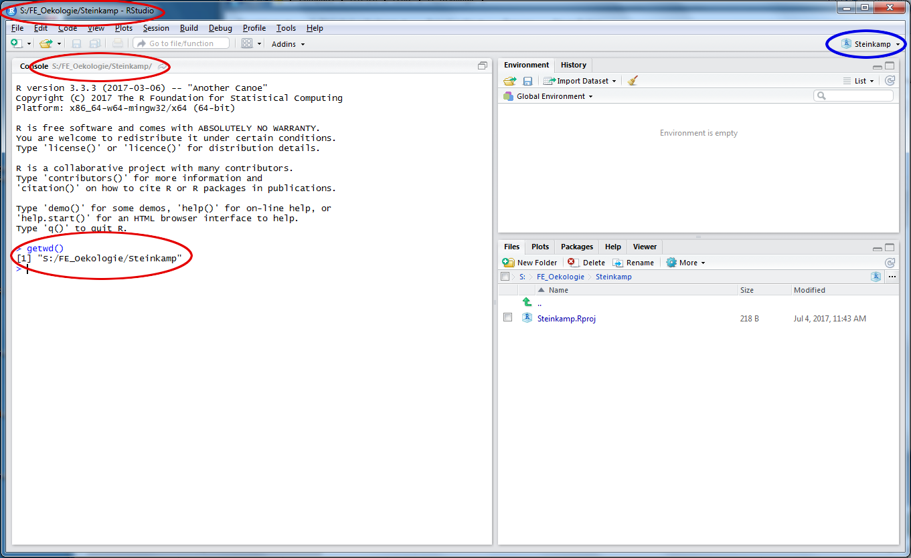
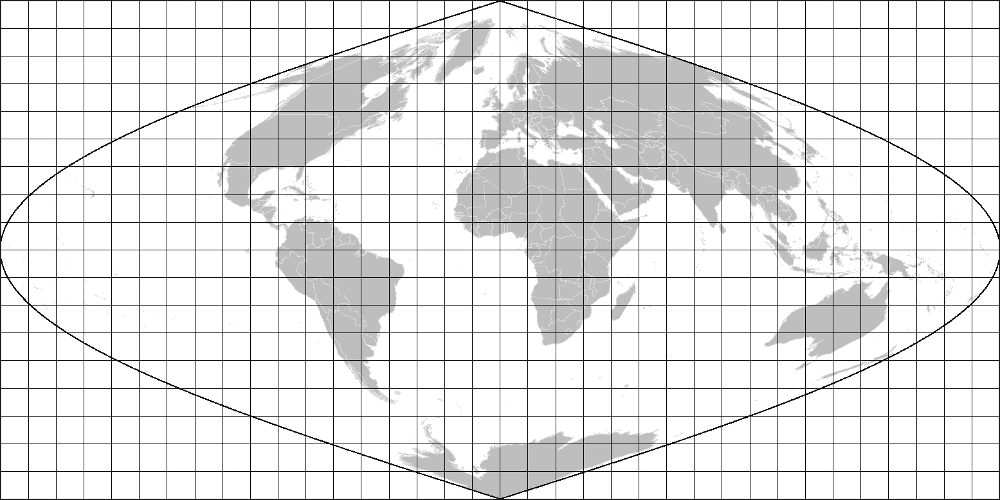
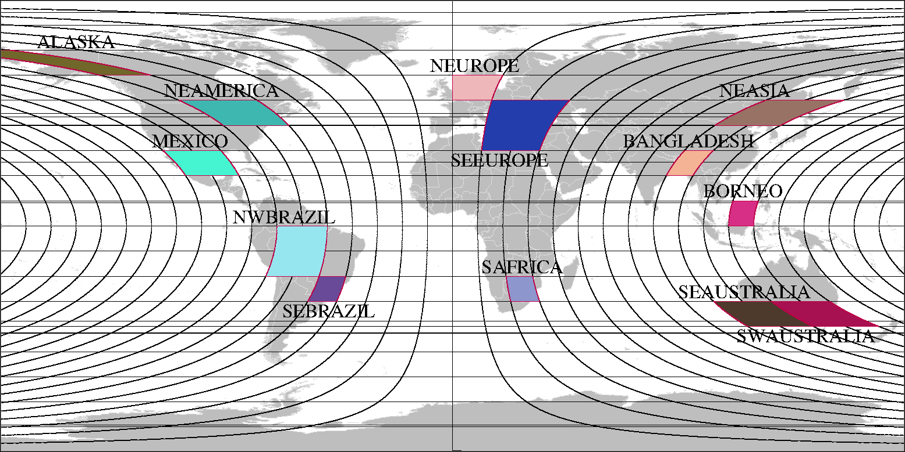

# Einführung

Das Seminar Material finden Sie im OLAT SOSE 2018.

Die Daten die im Kurs benutzt werden finden Sie unter:
https://powerfolder.gwdg.de/filestable/MjRGYXU2YUViNThFdU5yMlFhZXV2


## Rstudio

[RStudio](https://www.rstudio.com/) ist eine sogenannte Entwicklungsumgebung für [R](https://cran.r-project.org/). Hier können Programme geschrieben und getestet werden. Die wichtigsten Teile hierbei sind der Editor und die Konsole. Im Editor werden Programme geschrieben und als Textdateien gespeichert. In der Konsole werden die Programme ausgeführt und die Rückmeldung der einzelnen Befehle erfolgt hier.

Nach dem Start von R-Studio erstellen Sie ein leeres Projekt in einem neuen Verzeichnis unter 'S:\\FE_Oekologie' mit Ihrem Namen. Das erfolgt über das Dropdown-Menü *File* --> *neues Projekt ...*. Folgen Sie den Screenshots rechts am Rand. Unter dem Punkt 'Verzeichnisname' des letzten Screenshots tragen Sie bitte Ihren Namen **ohne Umlaute**, **ohne Sonderzeichen** und **ohne Leerzeichen** ein.

```{r echo=FALSE, out.width="33%", fig.cap="Menues zur Erstellung eines neuen Projektes in einem neuen Verzeichnis.", fig.subcap=c("Neues Verzeichnis", "Leeres Projekt", "Projekt Name")}
knitr::include_graphics(paste0("RStudio_Screenshot_0", 2:4, "_menu.png"))
```

Nachdem das Projekt erstellt wurde sieht RStudio wie im folgenden Screenshot aus. Dabei ist noch kein Editor offen, die Konsole füllt die gesamte linke Seite.

```{r echo=FALSE, out.width="75%", fig.align="right", fig.cap="RStudio nach dem Erstellen des neuen Projektes. In rot markiert sind die Stellen, an denen das aktuelle Arbeitsverzeichnis steht. Blau umrandet ist der Projektname."}

```

Dieses erstellte Projekt wird das ganze Seminar durch benutzt. Um den Editor zu öffnen, können Sie entweder über das Menü *Datei* --> *neue Datei* --> *R Script* ein Editorfenster öffnen, oder über das Symbol ganz links oben. Jedes Thema soll in einer Datei gespeichert werden. **Aufgaben** sollen direkt in dieses Skript eingefügt werden. **Hausaufgaben** müssen in einer extra Datei gespeichert werden. Dazu kann zur Vereinfachung das jeweilige Skript kopiert werden (Entweder mit Copy/Paste oder im Explorer). 

## Pakete laden und installieren

Zunächst müssen alle benötigten Pakete installiert werden. Dies sind in unserem Fall Pakete zum ...

1. Prozessieren von geokodierten Rasterdaten (raster, rgeos), 

2. Visualisieren (ggplot2; [Online Hilfe](http://docs.ggplot2.org/current/)),

3. Installieren von Nicht-Standard Paketen (devtools).

Ausserdem benötigen wir:

4. Basiskarten (rworldmap, maps, mapproj),

5. und das Seminarpaket (FEglobaleOekologie).

```{r, eval=FALSE, message=FALSE}
for (p in c("raster", "rgeos", "ggplot2", "rworldmap", "maps", "mapproj", "rgdal", "devtools")) {
  if (!require(p, character.only=TRUE)) {
    install.packages(p)
    library(p, character.only=TRUE)
  }
}
if (!require(FEglobaleOekologie)) {
  library("devtools")
  install_github("joergsteinkamp/FEglobaleOekologie")
}
```

## Regionen
```{r echo=FALSE, fig.margin=TRUE,out.width="95%", fig.cap="\\label{fig:fig3}MODIS Kacheln in sinusoidaler Projection."}

```
```{r echo=FALSE, fig.margin=TRUE,out.width="95%", fig.cap="\\label{fig:fig4}MODIS Kacheln in geographischer Projection."}

```
Die Originaldaten liegen in der sogenannten sinusoidalen Projektion (Fig. \ref{fig:fig3}) im Datei-Format [HDF](http://hdfeos.org/) (hierarchical data format) vor. In der "normalen" geographischen Projektion (Fig. \ref{fig:fig4}) sehen die einzelnem Kacheln gegen die Ränder hin immer verzerrter aus. In der zweiten Karte sind die vorhandenen Daten zu sehen. Nur die 4-kacheligen (NWBRAZIL und SEEUROPE) sind nicht verfügbar, da sie zu groß sind. Jede Gruppe muss eine Region bearbeiten. In einzelnen Sitzungen kann es jedoch je nach Aufgabenstellung vorkommen, dass zu einer anderen Region gewechselt werden muss.

Es folgt die Initialisierung der beabeiteten Region und der Pfade zu den Daten und Bildern. Ersetzen Sie die Pfadangabe der Variable baseDir mit dem Pfad Ihres Arbeitsverzeichnisses (sie haben dies sehr wahrscheinlich auf dem Laufwerk S: angelegt; mit dem Kommando getwd() in der Konsole zeigt Ihnen R Ihr aktuelles Verzeinis an). Bestätigen sie Nachfrage von fegloekInit() bei der Erstellung von Verzeichnissen mit y für yes. `fegloekOptions()` zeigt Ihnen die initialisierten Variablen für Ihre Region an.
```{r message=FALSE, warning=FALSE, results='hide'}
library(raster)
library(ggplot2)
library(FEglobaleOekologie)
# fegloekOptions(baseDir = getwd())
fegloekOptions(baseDir = "/home/gitta/R/Lehre")
fegloekOptions(region = "ALASKA")
fegloekInit()
fegloekOptions()
```

```{r, echo=FALSE}
source(file.path(getOption("fegloekBaseDir"), "R", "variables.R"), encoding=getOption("encoding"))
source(file.path(getOption("fegloekBaseDir"), "R", "functions.R"), encoding=getOption("encoding"))
```

# Erste Karten

## Weltkarte

Da wir nicht die ersten sind die R benutzen um Karten
zu erstellen nutzen wir eine vorgefertigte Karte aus dem Paket "maps"
die für die Darstellung mit dem Befehl 'map_data' aus dem Paket 'ggplot2' aufbereitet wird.
\marginnote{
\textbf{Aufgabe}\\
Die Zeile $p = p + coord \_ fixed()$ kann z.B. mit
$p = p + coord \_ map("ortho", orientation=c(45, 8, 0))$
 ersetzt werden.
Finden Sie mit Hilfe der Hilfeseiten heraus, ob es noch andere Projektionen
gibt und probieren diese aus.}
\marginnote{
\textbf{Daueraufgabe}\\
Schauen Sie sich sich Variablen mit den Befehlen 'head()' und 'str()' an, um zu verstehen, was Sie gerade gemacht haben.}
Hier sind die Befehle aus dem Paket ggplot2 Paket, mit denen eine erste Weltkarte in Form der Ländergrenzen erstellt wird. Führen sie nach jeder Zeile nach 'p = p + geom_path()' den Befehl print(p) aus, um zu sehen, welche Auswirkungen die jeweiligen Änderungen haben.
```{r, message=FALSE, warning=FALSE, out.width="75%", fig.align='center'}
worldmap <- map_data("world")
p <- ggplot(worldmap, aes(y=lat, x=long, group=group))
p = p + geom_path()
p = p + coord_fixed()
p = p + labs(title="Laendergrenzen")
p = p + xlab("Laenge")
p = p + ylab("Breite")
print(p)
```

## Regionale Karte mit Landbedeckung

Die von uns vorprozessierten Daten (LUC_ALASKA.zip) werden geladen. Sie können die Daten entweder mit der Funktion download.file() oder von Hand herunterladen. Achten Sie darauf die Datei im Data Verzeichnis abzuspeichern (getOption("fegloekDataDir")).
```{r}
fileName <- paste0("LUC_", getOption("fegloekRegion"), 
                   ".zip")
#file='https://www.dropbox.com/sh/1rcz0fjmgz2hnuh/AABBwtgJHlcD21y5t43NFLpma/Daten/LUC_ALASKA.zip?dl=0'
#oder
file='https://powerfolder.gwdg.de/dl/fiXNVFhCv7bwzo33Hj8Rys5L/LUC_ALASKA.zip'
download.file(file,file.path(getOption("fegloekDataDir"),fileName))
unzip(file.path(getOption("fegloekDataDir"), fileName), 
            exdir = getOption("fegloekDataDir"))
```
Lesen Sie nun die Landbedeckungsdaten Klasse 3 für das Jahr 2001 ein. Die Rasterdaten
werden in einen "data.frame" umgewandelt und die Spalten umbenannt.

```{r}
year <- 2001
lct <- 3
data.dir <- file.path(getOption("fegloekDataDir"), getOption("fegloekRegion"))
file <- file.path(data.dir, paste0("MCD12Q1_GEO_lres_", year, "-01-01.Land_Cover_Type_", lct, ".tif"))
```

Der nun folgende Teil wird in fast allen folgenden Skripten wieder kommen. Deshalb werden wir ihn gemeinsam in eine Funktion packen, die in einer Datei 'functions.R' gespeichert werden soll. Dabei wird der Pfad zu dem GeoTiff dieser Funktion als Argument übergeben. Die Funktion liefert dann die Datentabelle (data.frame) zurück, welche einer Variablen zugewiesen werden kann.
```{r}
rLCT  <- raster(file)
dfLCT <- as.data.frame(rasterToPoints(rLCT))
colnames(dfLCT) <- c("x", "y", "id")
```
\marginnote{
\textbf{Aufgabe}\\
 Entfernen Sie den Wert für 'FillValue/Unclassified' in der Spalte 'id' des data.frames 'dfLCT',
 so dass er nicht in der Legende auftaucht. Den Zahlenwert für 'FillValue/Unclassified' finden Sie auf der MODIS-Webseite: \href{https://www.google.de/search?q=MCD12Q1}{Google-Suche nach 'MCD12Q1'}.
}

```{r, echo=FALSE}
dfLCT = subset(dfLCT, id < 254)
```

Allen gültigen numerischen IDs werden ihre Namen zugewiesen. Dafür muss eine lookup-Tabelle LCT3lookuptable erzeugt werden, die die Spalten 'id' und 'name' hat. Die lookup-Tabelle und der Landnutzungsdatendatz werden anhand der gemeinsamen Spalte 'id' verbunden, 'all.X=TRUE' stellt hierbei sicher, dass alle Zeilen aus dfLCT erhalten bleiben. Ist ein 'id'-Wert aus dfLCT nicht in LCTlookuptable bekommt 'name' den Wert 'NA' für 'not available'.
\marginnote{\textbf{Aufgabe}\\
Suchen Sie auf der \href{https://lpdaac.usgs.gov/dataset_discovery/modis/modis_products_table/mcd12q1}{MODIS-Webseite} nach der entsprechenden Tabelle (Land Cover Types Description, Type 3) und erzeugen Sie die lookup-Tabelle. Kopieren Sie hierfür die Tabelle in eine Textdatei und lesen Sie diese mit der read.table() Funktion und selektieren Sie dann die Klassifikation Type 3.}

```{r}
dfLCT = merge(dfLCT, LCT3lookuptable, by="id", all.x=TRUE)
```

Nun können wir mit den Funktionen aus dem Paket ggplot2 wieder eine Karte erzeugen. Hierbei stehen die Landcover Klassifikationen im Vordergrund. Zusätzlich werden noch vier von uns vordefinierte Punkte (Variable 'points', V1-4) auf der Karte verzeichnet. An diesen werden in den folgenden Skripten Vegetationsindizes untersucht.

```{r, message=FALSE, warning=FALSE}
points <- getOption("fegloekPoints")

p <- ggplot(dfLCT, aes(x = x, y = y))
p = p + geom_raster(aes(fill = name))
p = p + geom_path(data = worldmap, size = 0.1, colour = "black",
                  aes(x = long, y = lat, group = group))
p = p + geom_point(data = points, aes(x = long, y = lat),
                   color = "black", shape = 10, size = 2.5)
p = p + geom_text(data = points, aes(x = long, y = lat, label =
                  paste0("V", rownames(points))),
                  hjust = c(-0.1, -0.1, 1.1, 1.1))
p = p + coord_fixed(xlim = c(min(dfLCT$x), max(dfLCT$x)),
                    ylim = c(min(dfLCT$y), max(dfLCT$y)), expand = FALSE)
p = p + theme(legend.position = "bottom")
p = p + guides(fill = guide_legend(title = NULL, ncol = 3))
p = p + labs(title = "MODIS MCD12Q1 Landcover")
p = p + xlab("Longitude")
p = p + ylab("Latitude")
```
\marginnote{\textbf{Aufgabe}\\
Ändern Sie in den abgebildeten Kartenausschnitt so dass nur der Bereich zwischen Longitude -160 und -140 gezeigt wird. Setzen Sie die Legende statt unter die Abbildung über die Abbildung. Was setzt der Parameter ncol in der Funktion guide_legend? Setzen Sie als Überschrift über die Legende den Text "Land cover types". Ändern Sie die Dicke der Ländergrenzen.}

Anschließend wird eine Karte mit der entsprechenden Region erzeugt und in einer PDF Datei gespeichert.

```{r, echo=FALSE, fig.width=5, fig.height=6, out.width="80%", fig.align="center"}
print(p)
```

```{r, eval=FALSE}
file <- paste0(getOption("fegloekRegion"), "_LCT", lct, "_", year, ".pdf")
pdf(file.path(getOption("fegloekFigDir"), file), paper="special", width=10, height=10)
print(p)
dev.off()
```

\pagebreak

Der Befehl 'table()' zählt gleiche Werte in einem Vektor (eine Spalte eines data.frames ist ein Vektor). Es kann auch der Befehl ddply aus dem Paket plyr verwendet werden, der einen data.frame zurück liefert, aber etwas komplizierter ist.
```{r, eval=FALSE}
table(dfLCT$name)
```
```{r, echo=FALSE}
knitr::kable(plyr::ddply(dfLCT, c("id", "name"), plyr::summarize, count=length(name)))
```

# Hausaufgaben

1. Wiederholen Sie die Aufgabe mit Land Cover Type 1. Das sollte idealerweise in Form einer for-Schleife mit der Variablen lct gemacht werden. (2 Punkt)

2. Es sind Daten für die Jahre 2001 und 2010 vorhanden. Schreiben Sie erneut eine Schleife für diese 2 Jahre, so dass Sie am Ende vier Karten haben: 2001 + LCT1, 2001 + LCT3, 2010 + LCT1, 2010 + LCT3. (2 Punkt)

3. Schreiben Sie eine Funktion, die eine Spalte 'name' mit der Landbedeckung als Character anhängt (basierend auf der numerischen Spalte 'id' der Landbedeckungsklasse). (1 Punkt)

4. Benutzten Sie den Befehl 'scale_fill_manual' um den Biomen sinnvolle Farben zuzuweisen. (Mit der geladenen ggplot2 library können Sie mit ?scale_fill_manual die Hilfe aufrufen. Beachten Sie auch das cheat-sheet im OLAT.) (1 Punkt)

5. Wieviel Fläche bedecken die einzelnen Landbedeckungslassen? Hinweis: das Paket "raster" hat eine Funktion "area" mit deren Hilfe die Größe jedes Pixels in km^2^ berechnent werden kann. (1 Punkt)
